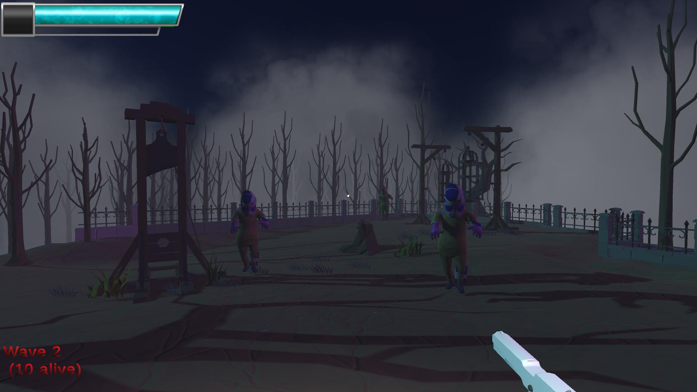

# Waves of The Undead

## Beschreibung des Spiels
Dieses Spiel ist ein spannender 3D First-Person-Shooter, bei dem du gegen Horden von Zombies antreten musst, um zu überleben. Deine Aufgabe ist es, so viele Wellen von Gegnern wie möglich zu überstehen, während sich die Anzahl und Stärke der Zombies mit jeder Welle erhöht. Du kannst verschiedene Waffen verwenden, um die Zombies auf Distanz zu halten und deine Überlebenschancen zu erhöhen. Sei auf der Hut, denn die Zombies werden immer gefährlicher!

### Steuerung

- **Bewegung**: Verwenden Sie die WASD-Tasten, um sich zu bewegen.
- **Aim**: Drücken Sie die rechte Maustaste, um zu zielen.
- **Schiessen**: Drücken Sie die linke Maustaste, um zu schiessen.
- **Waffenwechsel**: Drücken sie die Taste Q, um die Waffe zu wechseln.

Viel Spass beim Spielen und Überleben in der Welt der Zombies!

### Anmerkungen zur Entwicklung
Im Rahmen der Entwicklung haben wir einige Anpassungen an unseren ursprünglichen Planungen vorgenommen:

- Ursprünglich wollten wir Animationen für das Schiessen und Nachladen der Waffe implementieren, jedoch war dies zu aufwändig. Stattdessen haben wir uns auf die Implementierung verschiedener Animationen für die Gegnertypen konzentriert, um das Spielerlebnis zu verbessern.

- Die Idee, dass der Spieler Punkte für jeden getöteten Gegner erhält, und damit Verschiedene Waffen kaufen kann, haben wir verworfen. Stattdessen wird die Anzahl der lebenden Zombies auf dem Bildschirm angezeigt. Eigene implementation von Waffen war sehr herausfordernd, daher haben wir es auf 2 Waffen beschränkt.

- Der Spieler startet mit einem vorgegebenen Loadout, um das Gameplay einfacher und zugänglicher zu gestalten.

- ZombieSpawner Script ist umfangreich und skaliert die zombies mit den verschiedenen schwierigkeitsgraden.

### Zusätzliche Features die während der Entwicklung hinzugefügt wurden:

 - **Difficulty**: Es gibt 3 verschiedene Schwierigkeitsgrade, die sich auf die Anzahl der Gegner pro Welle auswirken. Die Schwierigkeitsgrade können im Hauptmenü ausgewählt werden.
 - **Zombie Types**: Es gibt 3 verschiedene Gegnertypen, die sich in ihrer Geschwindigkeit und ihrem Schaden unterscheiden. Die Gegnertypen werden zufällig generiert.
 - **Zombie Sounds**: Die Gegner haben verschiedene Sounds für das Laufen, Angreifen und Schaden nehmen.
 - **Zombie Animationen**: Die Gegner haben verschiedene Animationen für das Laufen und Angreifen.
 - **Zombie Death Animation**: Die Gegner haben eine Death Animation, wenn sie sterben.
 - **Zombie Death Sound**: Die Gegner haben einen Sound, wenn sie sterben.
 - **medikit**: Der Spieler kann ein Medikit aufheben, um seine Gesundheit wiederherzustellen.
 - **pause menu**: Der Spieler kann das Spiel pausieren und das Pausemenü öffnen, und mouse sensitivity ändern.
 - **hitmarker**: Der Spieler erhält ein visuelles Feedback, wenn er einen Gegner trifft.

### Zukünftige mögliche Features

- **Zombie Health Bar**: Die Gegner haben eine Health Bar, die über ihrem Kopf angezeigt wird.
- **Zombie Spawn Animation**: Die Gegner werden mit einer Spawn Animation generiert.
- **Zombie Spawn Animation**: Die Gegner werden mit einer Spawn Animation generiert.
- **Blood Particles**: Wenn ein Gegner getroffen wird, werden Blutpartikel generiert.
- **Weapon Reload Animation/Sound**: Die Waffe hat eine Nachladeanimation.

## Projektziele vom ursprünglichen Plan:

Input System
3D First Person Shooter, mit dem Ziel, Wellen von Gegner zu überleben. ✔

Der Spieler kann sich bewegen und die Kamera drehen. ✔

Die Gegner werden in Wellen spawnen und der Spieler muss diese mit Waffen töten. (10 Wellen) ✔ -> Modi mit 4 7 und 10 Wellen implementiert 

Der Spieler hat eine Lebensanzeige und wenn diese auf 0 fällt, ist das Spiel vorbei. (✔)

Die Gegner spawnen in immer grösseren Wellen. ✔

Die Gegner können sich bewegen und den Spieler angreifen. ✔

Gegner Knockback wenn getroffen ✔

verschiedene Gegner Types mit besondere Eigenschaften ✔ 3 verschiedene Gegner Typen implementiert

Sounds für Schüsse✔, Treffer✔ und Tod✔.

BGM für Menü und Spiel. ✔

Counter für Zombie Kills ~~(Der Spieler erhält Punkte für jeden getöteten Gegner.)~~  --> Lebende Zombies werden angezeigt ✔

Spieler startet mit einem Loadout✔ ~~(Der Spieler kann Waffen kaufen und diese dann benutzen.)~~

Scenes:
MainMenu ✔
Map1 ✔
Map2 ✔
Map3 ✔
Overlay/ESCMenu ✔
Endscreen ✔

Eigene Animation -> ~~Waffe schiessen, nachladen~~ --> zu aufwändig, statdessen verschiedene Animationen für Gegner implementiert ✔
